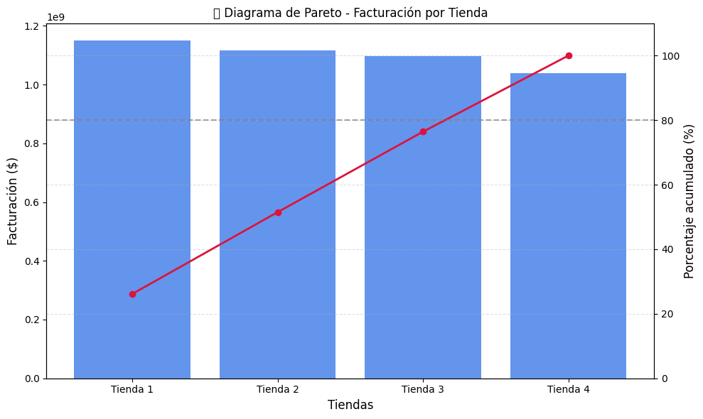

# Informe de Análisis: Desafío Alura Store

## 📄 Propósito del Proyecto

Este informe tiene como objetivo analizar el rendimiento de las cuatro tiendas de la cadena **Alura Store** para ayudar al Sr. Juan a decidir cuál de ellas debería vender, con el fin de invertir en un nuevo emprendimiento.

Se evaluaron cinco aspectos clave:

1. Facturación total de cada tienda
2. Categorías más populares de productos
3. Calificación promedio de los clientes
4. Productos más y menos vendidos
5. Costo promedio de envío

---

## 📊 Visualizaciones del Análisis

### 1. Facturación Total por Tienda

**Insight**: La Tienda 1 tiene la mayor facturación total (\$1,150,880,400), pero esto no significa que sea la más rentable si se consideran otros factores como la satisfacción del cliente y los costos logísticos.

---

### 2. Participación de Categorías (Tienda 1)

**Insight**: En todas las tiendas, las categorías más vendidas son **Muebles** y **Electrónicos**, representando una porción significativa del total de ventas.

---

### 3. Calificación Promedio por Tienda

**Insight**: La Tienda 3 tiene la mejor evaluación de los clientes (4.05), seguida muy de cerca por Tienda 2. Tienda 1 tiene la más baja (3.98), lo cual puede reflejar problemas en atención, calidad o experiencia de compra.

---

### 4. Precio vs Costo de Envío (Tienda 1)

**Insight**: No hay una correlación clara entre el precio del producto y su costo de envío. Sin embargo, Tienda 1 presenta los **costos de envío promedio más altos** de todas.

---

## 🧠 Conclusión y Recomendación Final

| Métrica                     | Mejor Tienda                                                    | Peor Tienda |
| --------------------------- | --------------------------------------------------------------- | ----------- |
| Facturación Total           | Tienda 1                                                        | Tienda 4    |
| Calificación Promedio       | Tienda 3                                                        | Tienda 1    |
| Costo Promedio de Envío     | Tienda 4                                                        | Tienda 1    |
| Productos con baja rotación | Todas con buen rendimiento, pero Tienda 1 destaca negativamente |             |

## 📊 Principales Visualizaciones

### 🔢 Facturación Total por Tienda

- Tienda 1 lidera en ingresos con más de $1,150 millones.
- Tienda 4 es la de menor facturación.

### 🛍️ Categorías Más Vendidas

Gráficos circulares individuales por tienda muestran las categorías más populares. Por ejemplo:

- Tienda 1: Tecnología y Moda  
- Tienda 2: Moda y Hogar  
- Tienda 3: Electrónica  
- Tienda 4: Libros y Ropa

### 📈 Diagrama de Pareto

Permite visualizar cómo Tienda 1, 2 y 3 concentran más del 77% de la facturación total, dejando a Tienda 4 con una participación marginal.

---

## 🧠 Recomendación Final

### 📌 Justificación Detallada

Aunque **Tienda 1 tiene la mayor facturación**, también presenta los siguientes problemas:

- La **peor calificación de clientes** (3.98)
- El **costo de envío más alto**
- **Baja rotación** de productos clave como “Pandereta” u “Olla de presión”

En contraste, otras tiendas tienen un mejor equilibrio entre rentabilidad, logística y experiencia del cliente.

### ✅ Recomendación

> Se recomienda al Sr. Juan **vender la Tienda 1**.  
> A pesar de su alta facturación, los **costos logísticos**, la **baja satisfacción del cliente** y la **eficiencia en declive** podrían comprometer su sostenibilidad a largo plazo.  
>
> **Tienda 3** representa el mejor desempeño balanceado y Tienda 4, aunque tiene la facturación más baja, **tiene potencial de crecimiento**.

---

## 🧾 Cómo Ejecutar el Proyecto

1. Abre el notebook `AluraStoreLatam.ipynb` en Google Colab.
2. Ejecuta las celdas en orden.
3. Analiza los gráficos generados y sigue el razonamiento paso a paso.
4. Puedes clonar este repositorio o trabajar directamente desde Colab con conexión a GitHub.

---

## ✉️ Contacto

Proyecto realizado como parte del desafío de Data Science – Alura Latam.  
Desarrollado por: SAUL EVER SANCHEZ MENDOZA  
GitHub: [[Sauluky](https://github.com/SauLucky)]  
