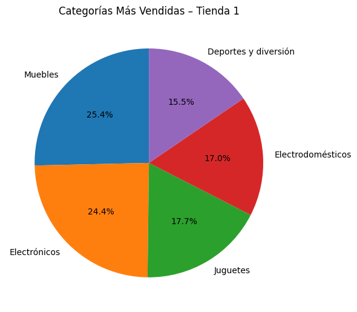
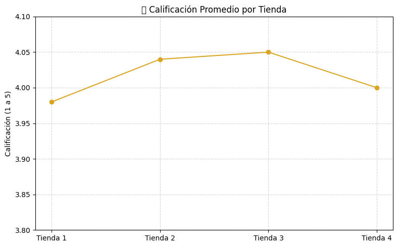
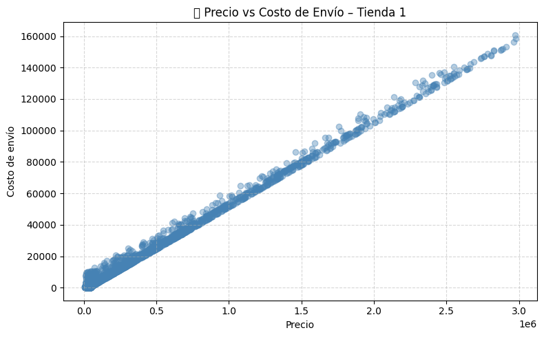

# Informe de Análisis: Desafío Alura Store

## 📄 Propósito del Proyecto

Este informe tiene como objetivo analizar el rendimiento de las cuatro tiendas de la cadena **Alura Store** para ayudar al Sr. Juan a decidir cuál de ellas debería vender, con el fin de invertir en un nuevo emprendimiento.

Se evaluaron cinco aspectos clave:

1. Facturación total de cada tienda
2. Categorías más populares de productos
3. Calificación promedio de los clientes
4. Productos más y menos vendidos
5. Costo promedio de envío

---

## 📊 Visualizaciones del Análisis

### 1. Facturación Total por Tienda

**Insight**: La Tienda 1 tiene la mayor facturación total (\$1,150,880,400), pero esto no significa que sea la más rentable si se consideran otros factores como la satisfacción del cliente y los costos logísticos.

---

### 2. Participación de Categorías (Tienda 1)

**Insight**: En todas las tiendas, las categorías más vendidas son **Muebles** y **Electrónicos**, representando una porción significativa del total de ventas.

---

### 3. Calificación Promedio por Tienda

**Insight**: La Tienda 3 tiene la mejor evaluación de los clientes (4.05), seguida muy de cerca por Tienda 2. Tienda 1 tiene la más baja (3.98), lo cual puede reflejar problemas en atención, calidad o experiencia de compra.

---

### 4. Precio vs Costo de Envío (Tienda 1)

**Insight**: No hay una correlación clara entre el precio del producto y su costo de envío. Sin embargo, Tienda 1 presenta los **costos de envío promedio más altos** de todas.

---

## 🧠 Conclusión y Recomendación Final

| Métrica                     | Mejor Tienda                                                    | Peor Tienda |
| --------------------------- | --------------------------------------------------------------- | ----------- |
| Facturación Total           | Tienda 1                                                        | Tienda 4    |
| Calificación Promedio       | Tienda 3                                                        | Tienda 1    |
| Costo Promedio de Envío     | Tienda 4                                                        | Tienda 1    |
| Productos con baja rotación | Todas con buen rendimiento, pero Tienda 1 destaca negativamente |             |

**Recomendación**: Se sugiere vender la **Tienda 1**, ya que a pesar de tener la mayor facturación, también es la que presenta **mayores costos logísticos**, **menor satisfacción del cliente** y **problemas de rotación en algunos productos**. Las otras tiendas presentan un rendimiento más equilibrado y sostenible en el tiempo.

---

## 📜 Instrucciones para Ejecutar el Notebook

1. Abre el archivo `AluraStoreLatam.ipynb` en Google Colab.
2. Ejecuta la primera celda para importar los datos desde las URLs proporcionadas.
3. Asegúrate de tener instaladas las bibliotecas `pandas` y `matplotlib`.
4. Ejecuta celda por celda para visualizar los análisis y gráficos.
